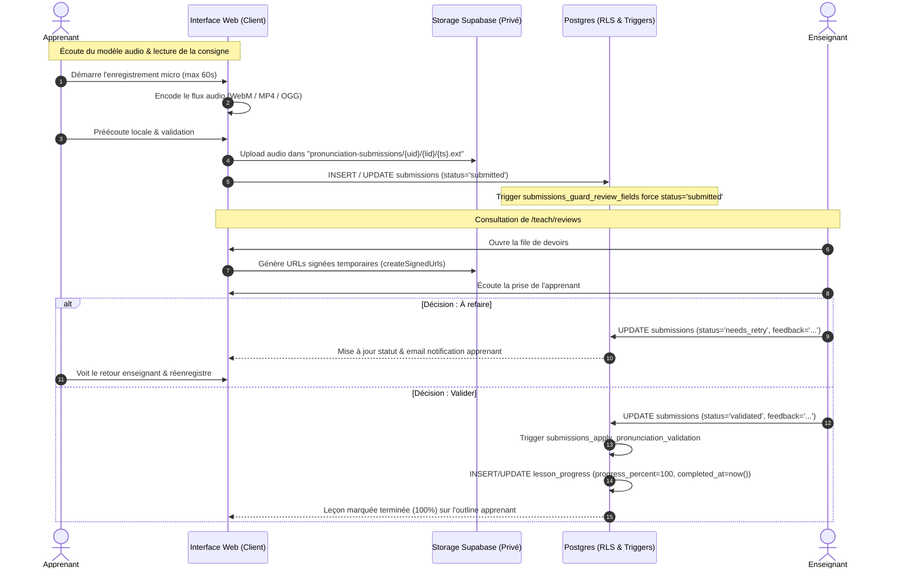

# Walkthrough Complet : Exercices de Prononciation & Tableau de Bord Enseignant

**Date d'exécution :** 3-4 octobre 2026  
**Branche Git :** `feat/pronunciation-and-teacher-progress`  
**Plan de référence :** [`docs/superpowers/plans/2026-10-04-pronunciation-and-teacher-progress.md`](file:///C:/Users/DELL%20LATITUDE%207480/wtp/docs/superpowers/plans/2026-10-04-pronunciation-and-teacher-progress.md)

---

## 1. Vue d'Ensemble & Objectifs Réalisés

Ce projet apporte une refonte et une extension majeure de la plateforme de cours en ligne, structurée autour de trois piliers fondamentaux :

1. **Harmonisation et centralisation des seuils de réussite** :
   - Remplacement des seuils éparpillés par des constantes uniques dans [`web/lib/courses/thresholds.ts`](file:///C:/Users/DELL%20LATITUDE%207480/wtp/web/lib/courses/thresholds.ts) :
     - **Quiz QCM** : seuil minimal de 70% (`QUIZ_PASS_PERCENT = 70`).
     - **Texte à trous (Fill-in-the-blank)** : seuil minimal de 80% (`FILL_IN_BLANK_PASS_PERCENT = 80`).
   - Correction du bug où un échec au texte à trous marquait la leçon complétée à 100%. Nettoyage de tous les `console.log` de débogage.

2. **Module complet d'exercices de prononciation audio** :
   - Nouveau format de leçon : `pronunciation`.
   - **Côté Enseignant (Auteur)** : possibilité de téléverser un enregistrement audio modèle que l'apprenant doit écouter et imiter, ainsi que la transcription ou consigne en Markdown.
   - **Côté Apprenant** : composant microphone réactif avec MediaRecorder (`PronunciationRecorder`), cascade de formats audio (WebM, MP4, OGG) pour compatibilité iOS Safari et desktop, préécoute locale avant soumission, et limitation stricte à 60 secondes et 5 Mo.
   - **Stockage Privé Sécurisé** : bucket Supabase Storage `pronunciation-submissions` avec politiques RLS isolant strictement les fichiers par identifiant apprenant (`{user_id}/{lesson_id}/...`).
   - **Côté Enseignant (Correction)** : file de correction `/teach/reviews` avec lecteur audio alimenté par URLs signées par lots (`createSignedUrls`), permettant de valider (`validated`) ou de demander un nouvel enregistrement (`needs_retry`) avec commentaire obligatoire.
   - **Sécurité Base de Données Anti-Triche** : la complétion d'une leçon de prononciation est gouvernée exclusivement par trigger PostgreSQL. Aucun client ne peut insérer, valider ou forger sa propre progression.

3. **Tableau de bord de suivi enseignant & métriques d'apprentissage** :
   - Fonction SQL RPC `public.course_progress_rows(p_course_id uuid)` en `security definer`, accessible uniquement au propriétaire du cours et aux administrateurs.
   - Agrégation statistique pure dans [`web/lib/courses/stats.ts`](file:///C:/Users/DELL%20LATITUDE%207480/wtp/web/lib/courses/stats.ts) calculant la progression globale, les complétions, les moyennes de notes et les taux de réussite par leçon.
   - Tri proactif des apprenants : les élèves ayant la progression la plus faible apparaissent en premier afin de guider l'accompagnement pédagogique.
   - Composant serveur [`CourseStatsPanel`](file:///C:/Users/DELL%20LATITUDE%207480/wtp/web/components/courses/CourseStatsPanel.tsx) intégré sur la page de gestion du cours (`/teach/[courseId]`).

---

## 2. Diagramme de Flux & Cycle de Vie de la Prononciation



---

## 3. Architecture Technique Détaillée

### A. Centralisation des seuils de passage (`web/lib/courses/thresholds.ts`)
```ts
export const QUIZ_PASS_PERCENT = 70
export const FILL_IN_BLANK_PASS_PERCENT = 80

export function isQuizPassed(score: number): boolean {
  return score >= QUIZ_PASS_PERCENT
}

export function isFillInBlankPassed(score: number): boolean {
  return score >= FILL_IN_BLANK_PASS_PERCENT
}
```

### B. Enregistreur & compatibilité navigateurs (`web/components/courses/PronunciationRecorder.tsx`)
- Ordre de détection dynamique des formats MIME supportés par `MediaRecorder` :
  1. `audio/webm;codecs=opus`
  2. `audio/webm`
  3. `audio/mp4` (indispensable pour Safari sur iOS)
  4. `audio/ogg;codecs=opus`
- Normalisation du type MIME de base via `baseMimeType(mime)` pour satisfaire les contraintes du bucket Storage Supabase (`audio/webm`, `audio/mp4`, `audio/ogg`, `audio/mpeg`).
- Nettoyage rigoureux : arrêt de toutes les pistes audio du flux microphone (`stream.getTracks().forEach(t => t.stop())`) et révocation des URLs d'aperçu Blob (`URL.revokeObjectURL`) au démontage du composant.
- Gestion d'erreur utilisateur traduite en français avec diagnostic explicite lors du refus d'accès au micro.

### C. Sécurité Database & Triggers Postgres Anti-Triche
1. **Verrouillage des champs d'évaluation (`submissions_guard_review_fields`)** :
   - Empêche un utilisateur (y compris un enseignant testant sa propre leçon) de s'auto-attribuer une note ou un statut `validated`.
   - Lors d'une nouvelle soumission après `needs_retry`, réinitialise automatiquement le statut à `submitted` et efface les anciens avis.
2. **Interdiction d'insertion directe de progression (`lesson_progress_guard_pronunciation`)** :
   - Déclencheur `BEFORE INSERT OR UPDATE` sur `lesson_progress`.
   - Lève l'exception `42501` si un client tente d'écrire une progression sur une leçon de type `pronunciation`.
   - Seul le trigger interne de validation, activant temporairement `set_config('app.pronunciation_validation', 'on', true)`, est autorisé à inscrire la réussite à 100%.
3. **Protection contre la suppression (`progress_delete_own`)** :
   - Politique RLS empêchant un apprenant de supprimer ou de révoquer sa progression sur une leçon de prononciation validée.
4. **Trigger d'application automatique (`submissions_apply_pronunciation_validation`)** :
   - Lors du passage de `status` à `'validated'`, crée ou met à jour immédiatement `lesson_progress` avec `progress_percent = 100` et `completed_at = now()`.
   - En cas d'invalidation (ex: passage à `needs_retry`), supprime la complétion de la leçon.

### D. Tableau de Bord Enseignant & RPC Postgres
- **Fonction RPC `course_progress_rows(p_course_id uuid)`** :
  - Déclarée `SECURITY DEFINER` avec vérification stricte : `c.owner_id = auth.uid() OR is_admin()`.
  - Joint les inscriptions (`enrollments`), profils (`profiles.name AS full_name`) et progressions (`lesson_progress`) du cours demandé.
  - Révoquée pour `public` et `anon`, réservée à `authenticated`.
- **Agrégation Statistique (`web/lib/courses/stats.ts`)** :
  - `enrolledCount` : nombre d'apprenants inscrits.
  - `averageProgress` : moyenne arithmétique de la progression de tous les inscrits.
  - `fullyCompletedCount` : nombre d'apprenants ayant terminé 100% des leçons.
  - `lessons` : taux de complétion par leçon (`completedCount / enrolledCount * 100`) et score moyen.
  - `learners` : progression individuelle triée par ordre croissant (`a.percent - b.percent`), mettant immédiatement en évidence les apprenants en difficulté.

---

## 4. Inventaire des Fichiers Créés et Modifiés

| Type | Fichier | Description |
| :--- | :--- | :--- |
| **Créé** | `web/lib/courses/thresholds.ts` | Seuils centralisés Quiz (70%) et FIB (80%) |
| **Créé** | `web/__tests__/course-thresholds.test.ts` | Tests unitaires des seuils de passage |
| **Créé** | `web/lib/courses/pronunciation.ts` | Helpers MIME, calcul des chemins Storage et labels |
| **Créé** | `web/__tests__/course-pronunciation.test.ts` | Tests unitaires des utilitaires de prononciation |
| **Créé** | `supabase/migrations/20261004000000_pronunciation_exercises.sql` | Migration SQL : bucket, types, contraintes et triggers |
| **Créé** | `web/__tests__/rls/pronunciation.test.ts` | Suite RLS 10 tests sur base Postgres réelle |
| **Créé** | `web/components/courses/PronunciationRecorder.tsx` | Enregistreur audio client MediaRecorder |
| **Créé** | `web/components/courses/PronunciationExercise.tsx` | Composant d'exercice côté apprenant |
| **Créé** | `web/components/courses/PronunciationReviewCard.tsx` | Carte de correction enseignant avec lecteur audio |
| **Créé** | `web/lib/courses/stats.ts` | Agrégation statistique pour le tableau de bord |
| **Créé** | `web/__tests__/course-stats.test.ts` | Tests unitaires des calculs de statistiques |
| **Créé** | `supabase/migrations/20261004000001_course_progress_rows.sql` | Migration SQL RPC `course_progress_rows` |
| **Créé** | `web/__tests__/rls/course-progress-rows.test.ts` | Suite RLS 4 tests pour l'accès sécurisé aux métriques |
| **Créé** | `web/components/courses/CourseStatsPanel.tsx` | Panneau de suivi enseignant (tuiles et tableaux) |
| **Modifié** | `web/lib/courses/types.ts` | Ajout du format `pronunciation` à `LessonKind` |
| **Modifié** | `web/lib/courses/assignment.ts` | Statuts `validated` / `needs_retry`, `audioUrl` |
| **Modifié** | `web/lib/courses/mutations.ts` | Fonctions `submitPronunciation` et `reviewPronunciation` |
| **Modifié** | `web/lib/courses/queries.ts` | `getPronunciationAudioUrl`, batching URLs, `getCourseProgressRows` |
| **Modifié** | `web/components/courses/FillInBlankExercise.tsx` | Utilisation de `FILL_IN_BLANK_PASS_PERCENT`, sans console.log |
| **Modifié** | `web/components/courses/LessonEditor.tsx` | Option prononciation, téléversement audio modèle |
| **Modifié** | `web/components/courses/ReviewQueue.tsx` | Intégration de `PronunciationReviewCard` |
| **Modifié** | `web/app/courses/[slug]/learn/[lessonId]/page.tsx` | Intégration exercice prononciation, désactivation bouton manuel |
| **Modifié** | `web/app/teach/[courseId]/page.tsx` | Intégration de `CourseStatsPanel` |
| **Modifié** | `web/app/api/courses/submissions/notify/route.ts` | Notifications email adaptées pour validation et retry |

---

## 5. Résultats des Tests & Validations Complètes

### A. Tests Unitaires (`npm run test`)
**24 suites passées avec succès, 210 tests au total (100% de réussite)** :
- `__tests__/course-thresholds.test.ts` (3 tests) : OK
- `__tests__/course-pronunciation.test.ts` (8 tests) : OK
- `__tests__/course-mutations.test.ts` (18 tests) : OK
- `__tests__/course-stats.test.ts` (7 tests) : OK
- `__tests__/course-assignment.test.ts` (4 tests) : OK
- `__tests__/course-fill-in-blank.test.ts` (5 tests) : OK
- `__tests__/course-outline.test.ts` (16 tests) : OK
- `__tests__/course-markdown.test.ts` (17 tests) : OK
- `__tests__/lesson-markdown.test.tsx` (7 tests) : OK
- `__tests__/course-payment.test.ts` (2 tests) : OK
- `__tests__/course-video.test.ts` (5 tests) : OK
- `__tests__/course-audio.test.ts` (4 tests) : OK
- `__tests__/course-quiz.test.ts` (4 tests) : OK
- `__tests__/course-slug.test.ts` (8 tests) : OK
- `__tests__/course-reorder.test.ts` (8 tests) : OK
- `__tests__/lexicon.test.ts` (11 tests) : OK
- `__tests__/verses.test.ts` (29 tests) : OK
- `__tests__/resource-mutations.test.ts` (14 tests) : OK
- `__tests__/resources.test.ts` (5 tests) : OK
- `__tests__/lexicon-search.test.ts` (5 tests) : OK
- `__tests__/contribution.test.ts` (14 tests) : OK
- `__tests__/donation.test.ts` (8 tests) : OK
- `__tests__/regions.test.ts` (4 tests) : OK
- `__tests__/numbered-textarea.test.tsx` (4 tests) : OK

### B. Tests RLS PostgreSQL réels (`node scripts/test-rls.mjs <suite>`)
**7 suites exécutées contre le moteur PostgreSQL Supabase local** :
1. `pronunciation` (10 tests) :
   - Blocage de l'insertion directe de progression (`42501`).
   - Forçage du statut `submitted` lors du dépôt.
   - Interdiction d'auto-validation par l'apprenant.
   - Validation enseignant déclenchant automatiquement la complétion (100%).
   - Gel des modifications de l'enregistrement validé.
   - Interdiction de suppression de la progression validée par l'apprenant.
   - Révocation de la complétion si l'enseignant bascule le devoir en `needs_retry`.
   - Réenregistrement possible après `needs_retry` réinitialisant le statut à `submitted`.
   - Suppression en cascade sans blocage de trigger.
   - Vérification du bucket `pronunciation-submissions` (5 Mo, formats autorisés).
2. `course-progress-rows` (4 tests) :
   - Retourne bien les données au professeur propriétaire.
   - Inclut les apprenants sans progression enregistrée (`lesson_id: null`).
   - Fonctionne pour les administrateurs.
   - Refuse l'accès aux apprenants, aux tiers et aux utilisateurs anonymes.
3. `phase4-assignments` (4 tests) : OK
4. `course-review-hardening` (14 tests) : OK
5. `progress-reports` (11 tests) : OK
6. `phase2-audio-quiz` (7 tests) : OK
7. `courses-core` (26 tests) : OK

### C. Vérification TypeScript & Build de Production
- `npx tsc --noEmit` : **0 erreur**. Typage strict vérifié sur l'ensemble du projet.
- `npm run build` : **Compilation réussie sans aucune erreur**. Toutes les routes dynamiques et statiques (dont `/teach/[courseId]`, `/courses/[slug]/learn/[lessonId]`, `/teach/reviews`) ont été générées et optimisées.
- **Audit de suppression (`git diff --diff-filter=D`)** : Aucun fichier ni route supprimé involontairement.

---

## 6. Déploiement Supabase Distant via MCP

Toutes les migrations ont été appliquées directement sur le projet Supabase distant `agdqbzbjcxrzfhkvempe` via l'outil `apply_migration` du serveur MCP Supabase :

1. **Migration `20261004000000_pronunciation_exercises.sql`** :
   - Contrainte `lessons_kind_check` mise à jour avec `'pronunciation'`.
   - Contrainte `submissions_status_check` mise à jour avec `'validated'` et `'needs_retry'`.
   - Bucket Storage privé `pronunciation-submissions` configuré (limite 5 Mo, types WebM, MP4, OGG, MPEG) et politiques RLS de stockage installées.
   - Triggers `submissions_guard_review_fields`, `lesson_progress_guard_pronunciation` et `submissions_apply_pronunciation_validation` actifs.
2. **Migration `20261004000001_course_progress_rows.sql`** :
   - Fonction RPC `public.course_progress_rows(p_course_id uuid)` installée et accessible aux enseignants.

---

## 7. Historique des Commits Git Réalisés

| Hash | Type | Message du Commit |
| :--- | :--- | :--- |
| `c199739` | `fix(courses)` | Centralise pass marks; failed fill-in-the-blank no longer adds progress |
| `b68240a` | `feat(courses)` | Pronunciation helpers, submission statuses and lesson kind types |
| `1f4bf47` | `feat(db)` | Pronunciation lessons with teacher-validated completion and recording bucket |
| `253496c` | `feat(courses)` | Submit and review pronunciation recordings |
| `c303846` | `feat(courses)` | Learner pronunciation recorder and exercise page |
| `a923165` | `feat(courses)` | Teacher pronunciation review card and lesson authoring |
| `ebeefe1` | `docs(courses)` | Record pronunciation verification walkthrough |
| `12f1938` | `feat(courses)` | Pure course statistics aggregation |
| `4d22f6c` | `feat(courses)` | Progress RPC for course owners |
| `88329d9` | `feat(courses)` | Teacher progress and scores dashboard |
| `74f80f5` | `docs` | Walkthrough for pronunciation exercises and teacher progress dashboard |
| `42c8911` | `docs` | Update walkthrough with successful remote MCP migration status |
